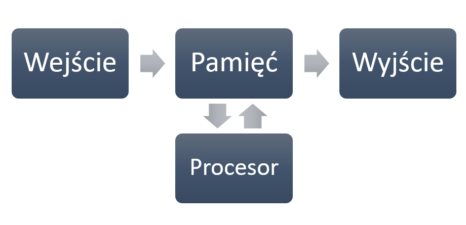
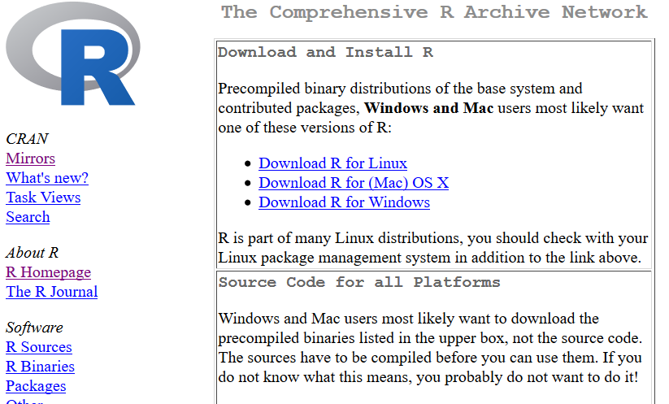
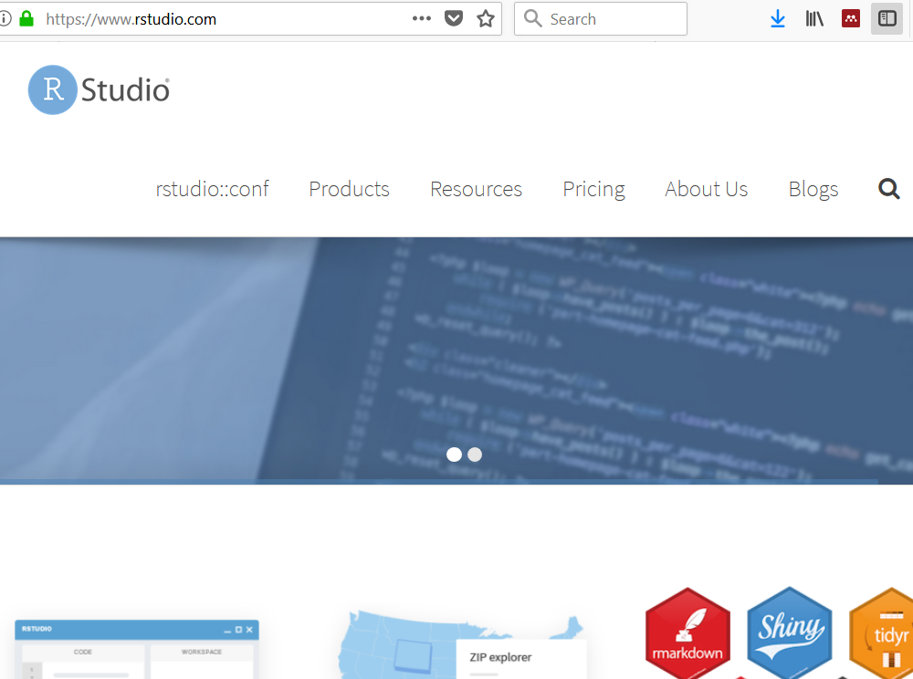
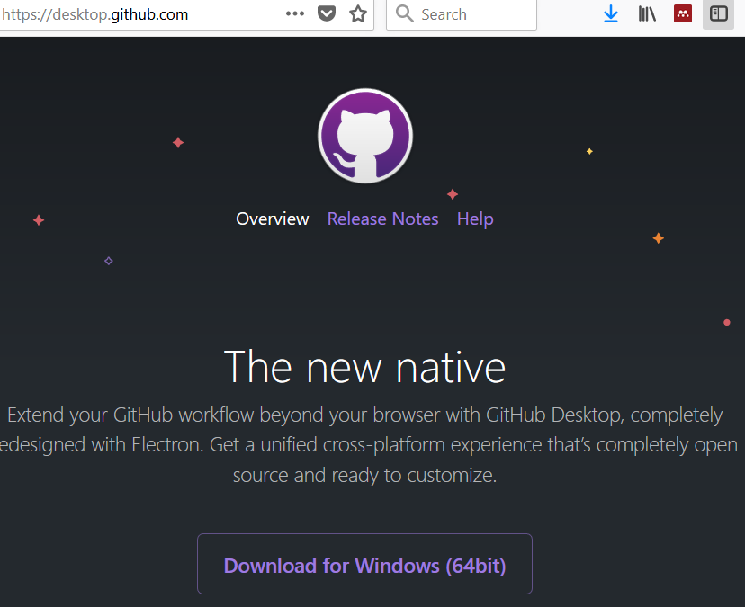
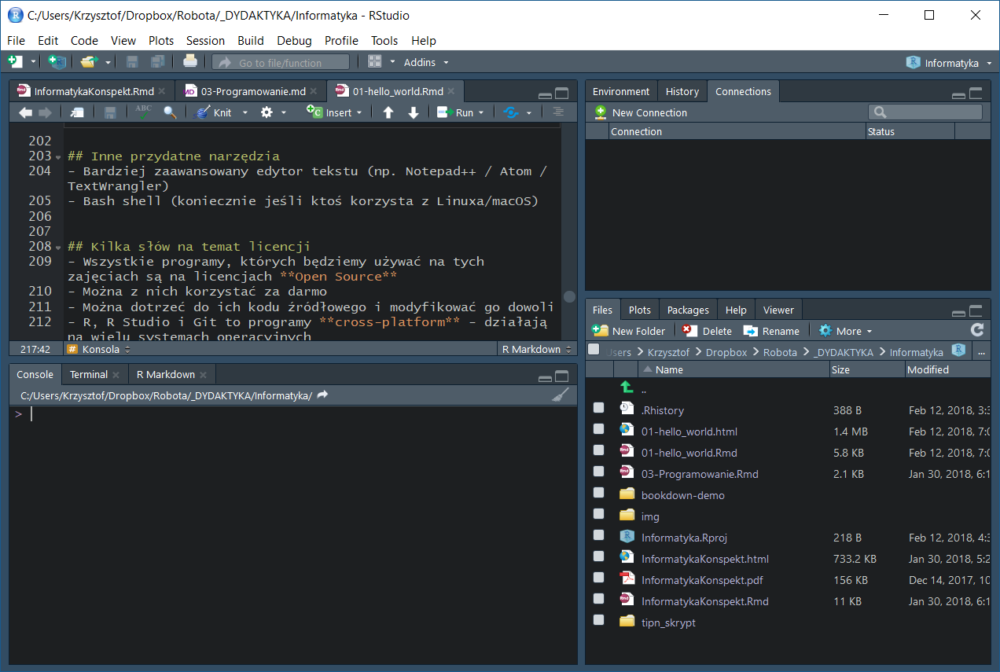

# Wstęp do programowania

## Po co ci to?
- Bo będziesz mądrzejszy
- Bo automatyzowanie czynności jest super
- Bo rozpoznasz, które problemy wymagają podejścia programistycznego
- Bo (po jakimś czasie) będziesz pracować szybciej

## Czego się nauczymy?
- Myślenia programistycznego, niezależnie od języka
- Myślenia wykorzystującego teorię informacji
- Korzystania z systemu kontroli wersji
- Korzystania z nowoczesnych technologii, dobrodziejstw otwartego oprogramowania i internetu
- Tworzenia ładnych i **reprodukowalnych** dokumentów

## Czego dokładnie się nauczymy?
- Podstaw programowania w języku `R`
- Podstaw korzystania z IDE (R Studio)
- Podstaw korzystania z technologii R Markdown
- Podstaw korzystania z Gita

## Reprodukowalna nauka
- Podstawowym mechanizmem kontrolnym w nauce jest **replikacja** wyników badań
- Analiza wyników jest także częścią badania
- Cel: 
    - każdy naukowiec na świecie może przeprowadzić daną analizę na zbiorze danych surowych
    - powinien otrzymać te same wyniki!
    - bardzo trudne do zrobienia przy pomocy narzędzi typu *point & click*

## O tym przedmiocie
- 6 spotkań po 5 godzin = 30 godzin
- Na każdych zajęciach robimy zadania
- Kto nie zdąży, robi w domu
- 1 nieobecność, ale wszystkie zadania muszą być!
- Zaliczenie bez oceny
- k.basinski@gumed.edu.pl

# Jak działają komputery

## Komputer == kalkulator

## Wejście i wyjście


## Dane wejściowe
- Klawiatura
- Myszka
- Touchpad?
- Plik na dysku
- Dane zdalne, uzyskane przez sieć
- etc.

## Pamięć
- RAM - Random Access Memory
- Pamięć "chwilowa" - informacje zapisywane na moment, po to by CPU wykonał operacje

## Procesor (CPU)
- Bardzo szybki kalkulator
- Jak szybki?
- Ok. 50 miliardów operacji na sekundę w nowoczesnym laptopie

## Dane wyjściowe
- Ekran
- Plik
- Słuchawki bluetooth
- Adresat e-maila
- etc.

## Bit
- Podstawowa jednostka informacji
- Przyjmuje wartości **0 lub 1**
- Ciąg ośmiu bitów daje jeden **bajt** - najprostszy sposób zapisania np. pojedyńczego znaku

## ASCII
- Siedem bitów
- Np. `011 1001` - cyfra *9*
- Np. `100 0001` - litera *A*
- Np. `010 0000` - spacja
- Jeden z możliwych standardów kodowania znaków

## UTF-8
- Złoty standard kodowania znaków
- 1,112,064 możliwych znaków
- od 8 do 32 bitów
- Dobra rada - jeśli możesz, **zawsze używaj kodowania UTF-8**
- Programy firmy Microsoft uporczywie *nie używają* kodowania UTF-8

## Bajty
- Osiem bitów daje jeden bajt
- Dokładając przedrostek (z układu SI), dostajemy znane jednostki
    + **KILO**bajty (1,000 bajtów)
    + **MEGA**bajty (1,000,000 bajtów)
    + **GIGA**bajty (1,000,000,000 bajtów)
    + **TERA**bajty (1,000,000,000,000 bajtów)

## Programy
- Skąd procesor wie, jakiego rodzaju operacje ma wykonać na danych? 
- Mówi mu to ciąg instrukcji zwany **programem**
- Program komputerowy działa tak samo jak programator w pralce
- Aby CPU zrozumiał program, musi on być napisany w **kodzie maszynowym**

## Kod maszynowy
    8B542408 83FA0077 06B80000 0000C383
    FA027706 B8010000 00C353BB 01000000
    B9010000 008D0419 83FA0376 078BD989
    C14AEBF1 5BC3

## Assembler
    fib:
    mov edx, [esp+8]
    cmp edx, 0
    ja @f
    mov eax, 0
    ret
    
    @@:
    cmp edx, 2
    ja @f
    mov eax, 1
    ret
    
    @@:
    push ebx
    mov ebx, 1
    mov ecx, 1
    
    @@:
        lea eax, [ebx+ecx]
        cmp edx, 3
        jbe @f
        mov ebx, ecx
        mov ecx, eax
        dec edx
    jmp @b
    
    @@:
    pop ebx
    ret

## C
    unsigned int fib(unsigned int n) {
    if (n <= 0)
        return 0;
    else if (n <= 2)
        return 1;
    else {
        unsigned int a,b,c;
        a = 1;
        b = 1;
        while (1) {
            c = a + b;
            if (n <= 3) return c;
            a = b;
            b = c;
            n--;
        }
      }
    }
    
## Języki programowania wysokiego/wyższego poziomu
- Java
- Ruby
- Pearl
- Python
- R

## R
- Język programowania do celów statystycznych (ale nie tylko!)
- Język *interpretowany*
- Język proceduralny, programowanie funkcjonalne
- Funkcjonalność rozszerzana poprzez **paczki** (*packages*)

## System operacyjny (OS)
- *Program do uruchamiania programów*
- Komunikuje się z *hardwarem*
- Zapewnia podstawowe funkcjonalności:
    + I/O
    + Sieć
    + Dostęp do danych na dysku
- Programy piszę się pod konkretny OS

## Systemy operacyjne


## Systemy operacyjne - Windows


## Systemy operacyjne - MacOS


## Systemy operacyjne - Linux


## Ćwiczenia
1. Ile twój komputer ma pamięci RAM? Gdzie to sprawdzić?
1. Jaki twój komputer ma procesor?
2. Ile twój komputer ma pamięci masowej?
1. Napisz krótki tekst w notatniku (ew. innym "prostym" edytorze tekstu). Zapisz tekst jako plik. Ile znaków napisałeś? Ile miejsca na dysku zajmuje plik?

# Potrzebne narzędzia

## CRAN (Comprehensive R Archive Network)


## R Studio


## GIT


## Inne przydatne narzędzia
- Bardziej zaawansowany edytor tekstu (np. Notepad++ / Atom / TextWrangler)
- Bash shell (koniecznie jeśli ktoś korzysta z Linuxa/macOS)
- Mendeley Desktop albo inny program do zarządzania bibliografią

## Kilka słów na temat licencji
- Wszystkie programy, których będziemy używać na tych zajęciach są na licencjach **Open Source**
- Można z nich korzystać za darmo
- Można dotrzeć do ich kodu źródłowego i modyfikować go dowoli
- `R`, R Studio i Git to programy **cross-platform** - działają na wielu systemach operacyjnych

# Hello World!

## Konsola


## Witaj świecie!
```{r eval=FALSE}
"Hello world!"
```

## Witaj świecie!
```{r}
"Hello world!"
```

## Dodawanie
```{r eval=FALSE}
2 + 2
```

## Dodawanie
```{r}
2 + 2
```

## Więcej arytmetyki
```{r eval=FALSE}
((234 + 766) / (0.5 * 2)) ^ 2
```

## Więcej arytmetyki
```{r}
((234 + 766) / (0.5 * 2)) ^ 2
```

## Dziwolągi liczbowe
```{r eval=FALSE}
1231098051234 / 0
```

## Dziwolągi liczbowe
```{r}
1231098051234 / 0
```

## Dziwolągi liczbowe, cd.
```{r eval=FALSE}
0 / 0
```

## Dziwolągi liczbowe, cd.
```{r}
0 / 0
```
