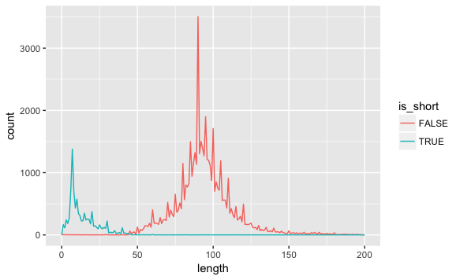

## Instrukcje ogólne

Jak zwykle, wszystkie rozwiązania umieść w swoim repozytorium na githubie (`tipn_zad_nazwisko`). Tym razem proszę, aby rozwiązania wszystkich zadań trafiły do jednego pliku o nazwie `zadania5.R`. Poszczególne zadania proszę oddzielić komentarzami w ten sposób:

```
# Zad 5-1
tu jakiś kod...

# Zad 5-2
tu jakiś kod...
```

Po każdym zadaniu zróbcie kilka pustych linijek, dla czytelności.

Na początku pliku należy dołączyć paczkę `tidyverse`. Do rozwiązania wszystkich zadań będziesz potrzebował `dplyr`, do niektórych również `ggplot`. Wszędzie, gdzie się da, **używaj rury** (`%>%`). Pamiętaj, aby po skończeniu pracy zrobić commit i pchnąć zmiany na github!

## Zadanie 5-1
W repozytorium przedmiotu (<https://github.com/k-basinski/tipn>), w katalogu `datasets` znajduje się plik `movies.csv`. Ściągnij go do swojego repozytorium i zaimportuj do R przy pomocy funkcji "import dataset" w R Studio. Pamiętaj, aby przekopiować kod kopiujący plik do swojego skryptu! Opis zbioru `movies` znajdziesz [tutaj](datasets/movies.html).

## Zadanie 5-2
Pokaż wszystkie komedie nakręcone w 2005 roku.

## Zadanie 5-3
Pokaż `tibble` z tytułami, rokiem produkcji i budżetem filmów uszeregowaną od najwyższego do najniższego budżetu.

## Zadanie 5-4
Jaki były najlepsze filmy animowane lat 90-tych?

## Zadanie 5-5
Jakie są najdłuższe dramaty wszechczasów?

## Zadanie 5-6
Dla każdego z kategorii MPAA policz średnią i odchylenie standardowe ocen filmów mających daną kategorię.

## Zadanie 5-7 \*
Czy wyższy budżet powoduje, że film jest lepszy? Narysuj ładny punktowy wykres w `ggplot` pokazujący tą zależność. Aby lepiej było widać zagęszczenie, zastosuj opcję `alpha = 3/10`. Narysuj na tym samym wykresie linię pokazującą korelację (`geom_smooth()`). Odfiltruj filmy, które:

- mają mniej niż 100 głosów
- mają budżet niższy niż 3 mln $ (nie interesuje nas kino studyjne:)

Podpowiedź - do ggplot także możesz wrzucić dane przy pomocy ` %>% `.

## Zadanie 5-8 \*
1. Jak rozkładają się długości filmów? Zrób wykres przy pomocy `geom_freqpoly()` z `binwidth = 1`. Żeby dobrze było wszystko widać, wywal filmy dłuższe niż 200 min. Jak możesz wyjaśnić to co widzisz na wykresie?

2. Narysuj podobny wykres, tym razem kolorami oznaczając rozkłady dla filmów krótkometrażowych i "nie-krótkometrażowych". Przyda się funkcja `ifelse()`. Wykres powinien wyglądać jakoś tak:


