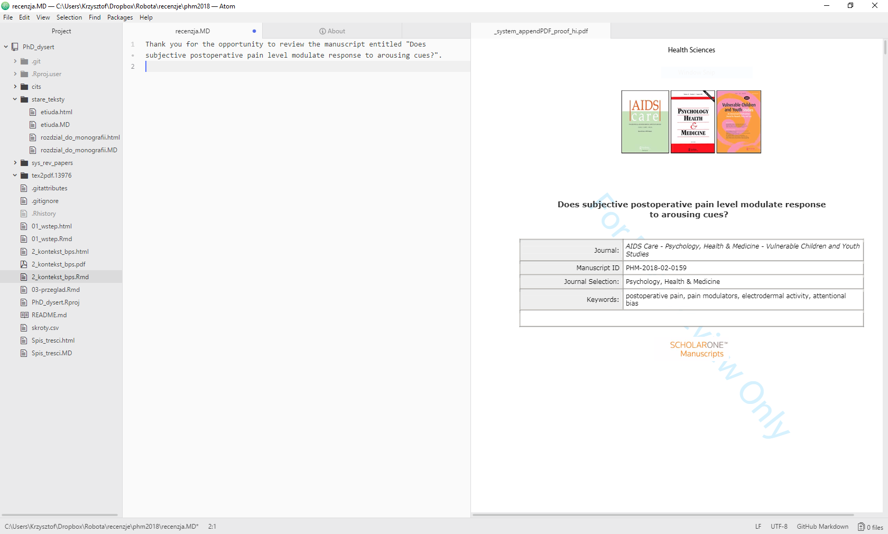

# R Markdown

# `R` - to baldly go...

## Książki Hadleya

<http://r4ds.had.co.nz>

<http://adv-r.had.co.nz>

## ggvis
<https://ggvis.rstudio.com>

## Shiny
<https://shiny.rstudio.com/gallery/>

## Konkurencja - Python
- Paczki: Numpy
- [Jupyter Notebooks](http://jupyter.org/)
- Psychopy

## Super fajne edytory tekstu

- Dla Win:
    + Notepad++
- Dla macOS:
    + TextWrangler
- UNIXowe klasyki:
    + VI/VIm
    + Emacs
- Cross-platform:
    + Atom (by GitHub)
    + SublimeText
    
## Atom jest super

