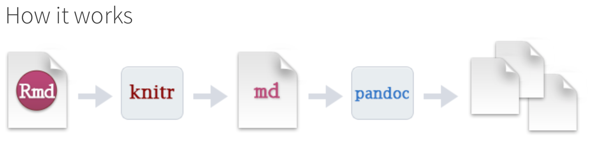
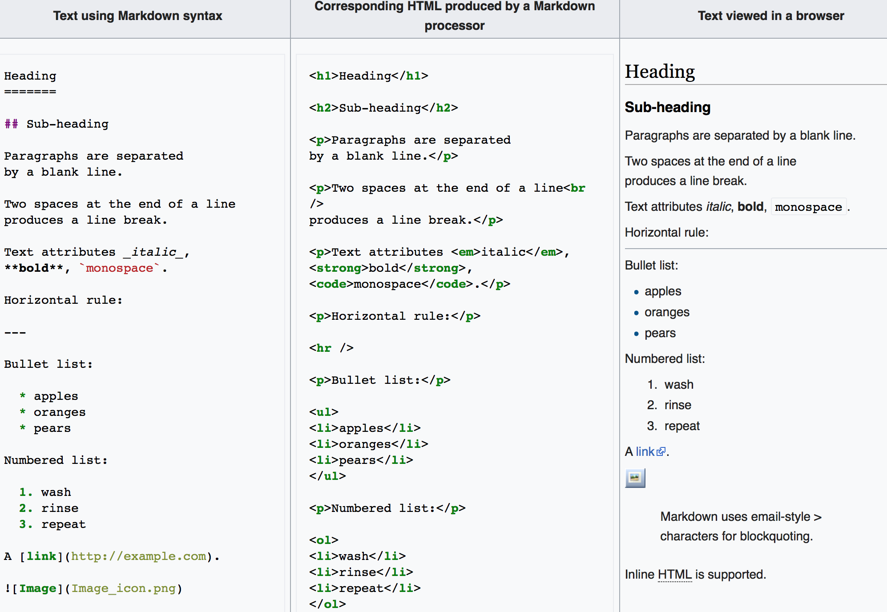

## R Markdown

To jest dokument przygotowany za pomocą R Markdown. Jest to technologia, która pozwala w prosty sposób pisać dokumenty, zamieszczać w nich wyniki obliczeń i wykresy wykonane w języku R, a następnie eksportować je do różnych formatów. M.in. w prosty sposób pozwala na tworzenie stron w HTML, PDFów, dokumentów MS Word, prezentacji, itp. 

Do pracy z R Markdown potrzebujesz zainstalować paczkę `rmarkdown`:

```r
install.packages("rmarkdown")
```

Jak działa R Markdown?


## Markdown

**Markdown** to język służący do prostego zapisu formatowania tekstu (*rich text*) za pomocą prostego tekstu (*plain text*). Pozwala na uzyskanie, w prosty sposób, estetycznie wyglądającego tekstu. Dodatkowo, dokumenty pisane w Markdown są (w miarę) czytelne same w sobie, w przeciwieństwie np. do dokumentów pisanych w TeX czy HTML. Teksty pisane w Markdown najczęściej konwertowane są do HTMLa i oglądane w przeglądarkach internetowych.



Jak korzystać z Markdown? Sprawdź tu: <https://github.com/adam-p/markdown-here/wiki/Markdown-Cheatsheet>

Z Markdown możesz korzystać w wielu różnych miejscach (np. prawie wszędzie na GitHubie, na Slacku etc.). Możesz w nim pisać ładnie wyglądające dokumenty za pomocą prostego edytora tekstu. Treść dokumentu może być później zamieniona (za pomocą programu Pandoc) na wiele różnych formatów (HTML, PDF, docx, etc.).

## Nagłówek `yaml`

Nagłówek `yaml` zaczyna się i kończy znakami `---`. W nagłówku musi być co najmniej informacja o tytule dokumentu i formacie wynikowym:

```yaml
---
title: "Jakiś tytuł"
output: html_document
---
```

Dodatkowo, w nagłówku znajdują się także inne informacje, charakterystyczne dla danego formatu wynikowego, i nie tylko. Zwróć uwagę, że w `yaml` ważne są wcięcia (tabulatory). Przykład bardziej rozbudowanego nagłówka: 

```yaml
---
title: "Ból - kontekst bio-psycho-społeczny"
author: "Krzysztof Basiński"
date: "February 14, 2018"
output:
  html_document:
    theme: spacelab
  pdf_document:
    latex_engine: xelatex
bibliography: library.bib
csl: apa.csl
link-citations: true
---
```

## Korzystanie z R w R Markdown

Skrót `Ctrl + Alt + I` (Na macOS `Cmd + Option + I`) dodaje **code chunk**. Wewnątrz możesz zawrzeć dowolny kod w języku R (albo w Bashu, albo w Pythonie, jak chcesz). Np.

```{r}
library(ggplot2)
ggplot(mpg, aes(displ, hwy, colour = class)) + 
  geom_point()
```

W R Studio **code chunks** są mogą być uruchamiane niezależnie, a ich wyniki można przeglądać wraz z kodem (nazywa się to **notebook interface**). Działa to tak, jakbyśmy pisali zwykły skrypt i przeplatali go kawałkami tekstu napisanego w Markdown. [Tutaj](chfq_cfa_ntbk.Rmd) znajdziesz przykład nieco bardziej rozbudowanego dokumentu R Markdown. [Tutaj](chfq_cfa_ntbk.html) zaś możesz podpatrzeć, jak wygląda po zrenderowaniu do htmla.


## Formaty wynikowe

Najczęściej (przeze mnie) używane formaty:

- [html_notebook](https://rmarkdown.rstudio.com/lesson-10.html)
- [html_document](http://rmarkdown.rstudio.com/html_document_format.html)
- [pdf_document](http://rmarkdown.rstudio.com/pdf_document_format.html) (uwaga! wymaga zainstalowanego TeXa!)
- [word_document](http://rmarkdown.rstudio.com/word_document_format.html)
- [revealjs::revealjs_presentation](https://rmarkdown.rstudio.com/revealjs_presentation_format.html) (uwaga! wymaga zainstalowanej paczki `revealjs`)

Więcej znajdziesz tu: <https://rmarkdown.rstudio.com/lesson-9.html> . Sky is the limit.

## Rozszerzenia R Markdown

Oprócz podstawowej funkcjonalności, R Markdown posiada też rozszerzenia. Przykładowe rozszerzenie pozwala formatować bibliografię, tak jak w [tym dokumencie](przyklad_bibliografii.html). Żeby to działało, potrzebujesz stworzyć plik `.bib`, zawierający twoją bibliografię w formacie BibTeX (uda ci się to np. za pomocą Mendeley) oraz dołączyć plik `.csl` zawierający opis formatu cytowań. Pliki csl możesz znaleźć tu: <https://www.zotero.org/styles> albo tu: <https://github.com/citation-style-language/styles>