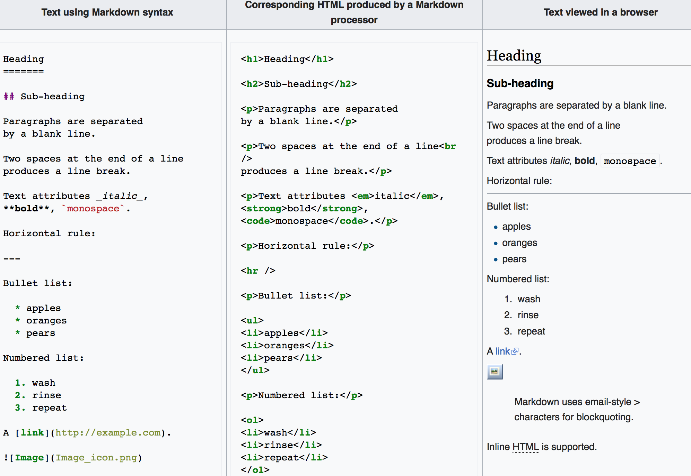

## R Markdown

To jest dokument przygotowany za pomocą R Markdown. Jest to technologia, która pozwala w prosty sposób pisać dokumenty, zamieszczać w nich wyniki obliczeń i wykresy wykonane w języku R, a następnie eksportować je do różnych formatów. M.in. w prosty sposób pozwala na tworzenie stron w HTML, PDFów, dokumentów MS Word, prezentacji, itp. 

## Markdown

**Markdown** to język służący do prostego zapisu formatowania tekstu (*rich text*) za pomocą prostego tekstu (*plain text*). Pozwala na uzyskanie, w prosty sposób, estetycznie wyglądającego tekstu. Dodatkowo, dokumenty pisane w Markdown są (w miarę) czytelne same w sobie, w przeciwieństwie np. do dokumentów pisanych w TeX czy HTML. Teksty pisane w Markdown najczęściej konwertowane są do HTMLa i oglądane w przeglądarkach internetowych.

Jak korzystać z Markdown? Sprawdź tu: <https://github.com/adam-p/markdown-here/wiki/Markdown-Cheatsheet>

